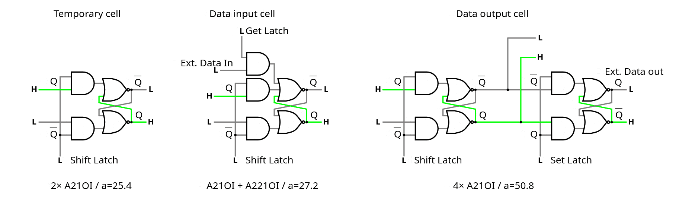

# Welcome to the TinyScanChain

This is a port of [https://github.com/YannGuidon/TinyScanChain](https://github.com/YannGuidon/TinyScanChain) to IHP SG13CMOS5L PDK, before I restart [https://hackaday.io/project/193122-dtap-debug-and-test-access-port](https://hackaday.io/project/193122-dtap-debug-and-test-access-port) )

## What is this Tiny Tapeout tile ?

Tiny Tapeout's (https://tinytapeout.com) run "ihp26a" provides 200µm × 150µm of estate on the German iHP SG13G2 technology. That's about 2K gates at best but you'll still want to spy on them : observability and control are necessary so you need a TAP (Test Access Port) !

But TinyTapout does not provide a JTAG-like interface, you're on your own. So let's make one. Unfortunately the typical BILBO gates are bulky and require large fanout, and interfere with the routing of the other gates.

The iHP SG13G2 PDK provides A221OI and A21OI gates which solve this problem. It's not JTAG-compatible but it's simple, functional and should not interfere with the main design (if the synthesiser cooperates)

.

## Resources

- [https://github.com/ygdes/ttihp-HDSISO8](https://github.com/ygdes/ttihp-HDSISO8) implements a high density shift register / delay line with DLHQ gates (standard latches) and 4-phase non-overlapping clocks.
- [https://github.com/ygdes/ttihp-HDSISO8RS](https://github.com/ygdes/ttihp-HDSISO8RS) enhances the density by 36% with a pair of A21OI gates instead of one DLHQ gate.

These projects have shown that an iHP tile could be filled with more than 1K Reset-Set latches, though the synthesiser and the place&route tools do not cooperate, reducing the rated speed to about 20MHz, whatever this means, since the clock is internally sped down by 8. Still, 1M bits per second is enough for a comfy debug session. However this should not affect the DUT's performance and it's now a matter of coercing the tools to de-prioritise the scan chain, and learn other tricks.

.

## How it works

First look at the projects above. Refresher:

In this TAP system we don't need the sophisticated demux-mux machinery that splits and merges the full-speed bitstream. Let's keep a rate of one bit per byte (think: SPI!) and a single chain (so far), let's KISS because size matters.

Then take one RSFF made from a couple of sg13g2_a21o_1 (area: 18.2) and add some features such as a second FF or another data input.

By comparison:

- sg13g2_dlhq_1 : area=30.84480

- sg13g2_dfrbpq_1 : area=48.98880

Note: The scan chain has a granularity of 4 steps but only 3 actual data bits. Clock pulses should always be in bursts of 8, each burst provides one bit, so the bits are grouped by 3. This implies that each transaction will certainly consist of sequences of 3 bytes over SPI.

.

.

## How to test

The pins are :

* SC_RESET clears the counter's state and the contents of the scan chain.

* SC_CLK advances the pulse counter/generator. 8 pulses advance the data by 1 bit.

* SC_DIN is the serial data input, must be set before clocking 8 pulses.

* SC_DOUT is the serial data output

* SC_GET is a control signal that transfers external data, in parallel, into the scan chain (if the cell allows it)

* SC_SET is a control signal that transfers the scan chain's value into the auxiliary latch for longer-term storage.

* DO0 to DO8 are extra output pins that are controlled by the scan chain and updated by a strobe on SC_SET

* DI0 to DI7 are extra input pins that are read into the scan chain during a strobe on SC_GET

* Count_Enable lets an internal free-running counter count. It is read by the scan chain during a strobe on SC_GET so it must be "frozen" to be sampled.

Pro tip : to save even more space, the GET strobe only sets bits in the scan chain. So you have to strobe RESET low first, which pre-clears the data.

## Structure of the scan chain :

For speed/convenience,

* the output/SET bits are located near the SC_DIN pin so they require the least shifting

* the input/GET bits are located closest to the SC_DOUT pin so they are most immediately available.

Thus we have 24 bits stored in the shift register, from SC_DIN to SC_DOUT:

- 9 bits SET to the output port (DO0-DO8)
- 8-bit LFSR (7 LSB visible, controlled by the internal clk and reset, enabled by Count_Enable)
- 8 bits GET from the input port (DI0-DI7)

They are in MSB-first order, but this is only for convenience here.

.

## Speed

It's an ASIC so it will be ... fast. The Johnson counter can easily reach 200MHz. It divides the clock by 8 and prevents most risks of setup&hold violations because the pulses do no olverlap, so in fact it could run even faster. There are very nice topologies that could be implemented...

Then it gets ugly. Experience with the other shift registers (SISO8xx) have shown that

* The synthesiser has no clue what this thing does, or how, and tries to optimise for the wrong parameters. Asynchronous logic is not its domain of excellence.

* Place and route are big offenders. Do it manually or script it.

Anyway, another project has reached a depth of close to 800 bits, so a chain of 200 bits would still work pretty well.

## External hardware

Hook it up to a microcontroller or CPU. Likely a Raspberry Pi. Software will be written, let's tape this chip out first.

## What next?

This is only a first, quick try. There are 2 ways to make it even better:

* Make "macros" that hide the characteristics from the synthesiser's sight and optimise the place&route.

* The original DTAP project is half-duplex and defines only 3 or 4 pins : CLK, R/W, with a split or shared serial in and out pin. The SC_GET and SC_SET signals should be controlled internally by a Finite State Machine to reduce the number of pins.

Stay tuned.

.

.

.

.

.

.

.

.
